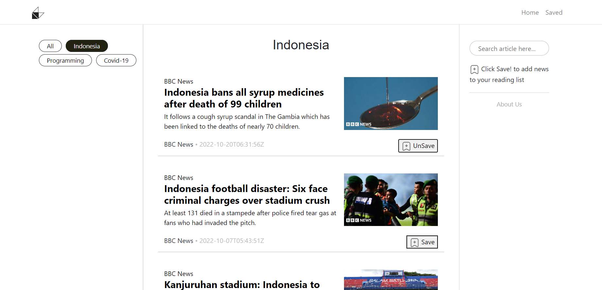

<!-- PROJECT LOGO -->
<div align="center">
  <a href="https://github.com/fitriaulias/Final_Project_Kel5/tree/main/final-project-1">
    
  </a>

  <h3 align="center">NewsInd</h3>

  <p align="center">
    NewsInd adalah aplikasi berbasis web yang menyediakan beragam kumpulan informasi berita dari berbagai kategori, diantaranya yaitu <strong>Indonesia</strong>, <strong>Programming</strong>, <strong>Covid-19</strong>, dan <strong>All</strong>. Fitur utama yang disediakan oleh NewsInd adalah aplikasi ini dapat menyimpan berita terpilih untuk dibaca kembali oleh pengguna.
    <br />
    <a href="https://github.com/fitriaulias/Final_Project_Kel5/tree/main/final-project-1"><strong>Explore the docs »</strong></a>
    <br />
    <br />
    <p>Final Project 1 oleh Kelompok 5</p>
  </p>
</div>

<br/>

<!-- TABLE OF CONTENTS -->
<details>
  <summary> :bookmark_tabs: Daftar Isi</summary>
  <ol>
    <li>
      <a href="#mentoring-status">Status Mentoring</a>
    </li>
    <li>
      <a href="#siapakah-kami">Siapakah Kami?</a>
    </li>
    <li>
      <a href="#tentang-project">Tentang Project</a>
      <ul>
        <li><a href="#built-with">Frameworks/Libraries</a></li>
      </ul>
    </li>
    <li>
      <a href="#getting-started">Getting Started</a>
      <ul>
        <li><a href="#installation">Instalasi Aplikasi</a></li>
        <li><a href="#cara-penggunaan-aplikasi">Cara Penggunaan Aplikasi</a></li>
      </ul>
    </li>
    <li><a href="#presentasi">Presentasi</a></li>
    <li><a href="#contact">Contact</a></li>
  </ol>
</details>

<br/>

<!-- STATUS MENTORING -->
## :heavy_check_mark: Status Mentoring 
Mentoring **telah dilaksanakan** pada:
:date: Tanggal dan waktu: 24 Oktober 2022, 10.00 WIB
Instruktur: Pak Arif Setiawan

<br/>

<!-- MEMBER GROUP -->
## Siapakah Kami?
* I Putu Gede Maysa Putra (RCTN-KS05-022)
* Dwi Samsiarto (RCTN-KS05-023)
* Fitri Aulia S. (RCTN-KS05-024)

<br/>

<!-- ABOUT THE PROJECT -->
## :newspaper: Tentang Project



Berita merupakan salah satu informasi mengenai peristiwa yang sedang atau baru saja terjadi. Melalui NewsInd kami menyediakan berbagai berita dari berbagai sumber.

Kategori berita yang tersedia yaitu:
* Indonesia: Menampilkan berita terkini yang berkaitan dengan Indonesia
* Programming: Menampilkan berita terkini seputar Programming
* Covid-19: Menampilkan berita terkini mengenai Covid-19
* All: Menampilkan berita top headlines yang berasal dari Indonesia

Fitur yang tersedia di NewsInd:
* Search: Memungkinkan pengguna untuk mencari berita sesuai kata kunci yang diinginkan
* Saved: Memungkinkan pengguna untuk menyimpan berita terpilih yang hendak dibaca kembali atau menghapus berita dari daftar bacaan

<br/>

### :books: Frameworks/Libraries

Daftar Frameworks/libraries yang kami gunakan:

* [![React][React.js]][React-url]
* [![Bootstrap][Bootstrap.com]][Bootstrap-url]

<br/>

<!-- GETTING STARTED -->
## Getting Started

Untuk menggunakan aplikasi NewsInd, langkah pertama yang harus dilakukan adalah instalasi aplikasi.


### Instalasi Aplikasi

Berikut langkah-langkah untuk instalasi aplikasi NewsInd.

1. Mendapatkan API Key dari [News API](https://newsapi.org/)
2. Clone repository
   ```sh
   git clone https://github.com/fitriaulias/Final_Project_Kel5.git
   ```
3. Install NPM packages
   ```sh
   npm install
   ```
4. Memasukkan API Key ke kategori_URL

<br/>

### :information_desk_person: Cara Penggunaan Aplikasi

<details>
    <summary>Mencari berita sesuai kategori</summary>
    
    <p>Klik kategori di sidebar sebelah kiri sesuai dengan kategori yang Anda inginkan. Contoh jika Anda ingin melihat berita mengenai Indonesia, maka Anda hanya perlu menekan tombol Indonesia.
    </p>
</details>
<details>
    <summary>Mencari berita sesuai kata kunci</summary>
    
    <p>Untuk mencari berita melalui fitur search, Anda hanya perlu mengetik kata kunci sesuai dengan berita yang Anda cari. Contoh jika Anda ingin mencari berita mengenai React maka ketikkan React dan tekan enter.
    </p>
</details>
<details>
    <summary>Menyimpan berita terpilih</summary>
    
    <p>Untuk menyimpan berita yang hendak Anda baca kembali, tekan tombol Save yang terletak di bagian bawah deskripsi berita.
    </p>
</details>
<details>
    <summary>Melihat berita yang disimpan</summary>
    
    <p>Semua berita yang telah Anda simpan tersimpan di halaman Saved. Untuk membuka kembali berita tersebut Anda hanya perlu menekan tombol Saved di bagian navigasi.
    </p>
</details>
<details>
    <summary>Menghapus berita yang disimpan</summary>
    
    <p>Untuk menghapus berita yang telah Anda simpan, cukup tekan tombol UnSave dan berita akan terhapus dari library saved Anda.
    </p>
</details>


